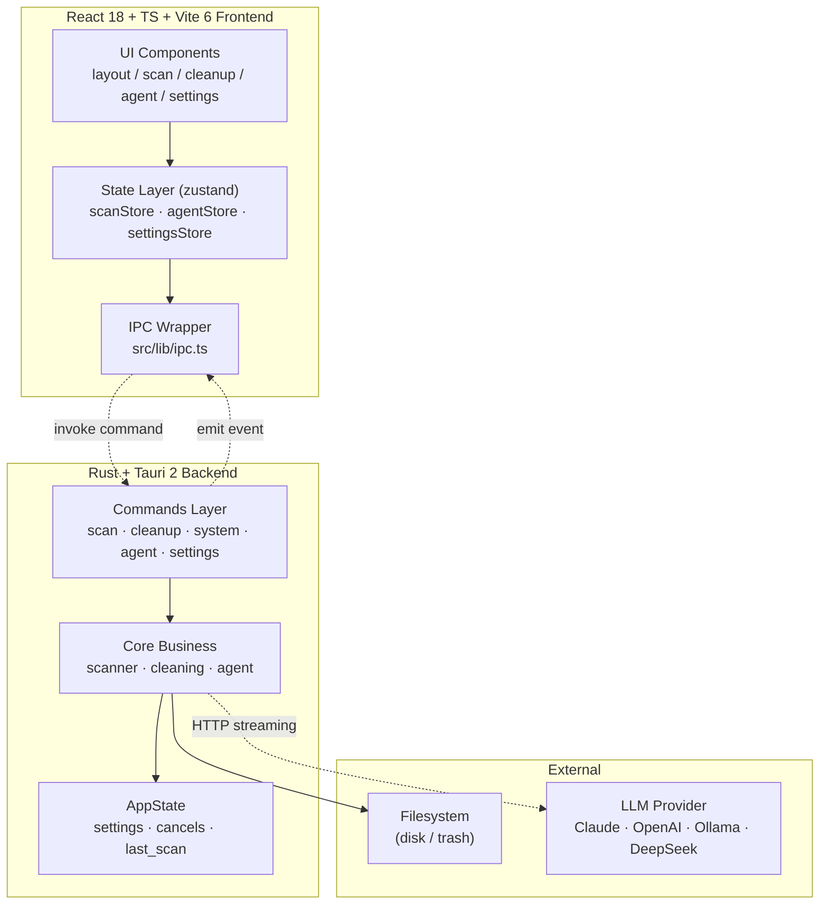

<div align="center">

# TrueClean

**Cross-platform disk cleaner with a built-in AI agent**

跨平台磁盘清理 + AI Agent 桌面应用 · Tauri 2 + React 18 + Rust

</div>

> **中文文档**：本 README 以英文为主。完整中文文档请点击 → [简体中文](./README.zh-CN.md)
>
> **English**: The main body of this README is in English. A full Chinese translation is available via the link above.

---

<div align="center">


</div>

---

## Table of Contents

- [Overview](#overview)
- [Key Features](#key-features)
- [Why TrueClean](#why-trueclean)
- [Architecture](#architecture)
- [Getting Started](#getting-started)
- [Configuration](#configuration)
- [Security Model](#security-model)
- [AI Agent](#ai-agent)
- [Tech Stack](#tech-stack)
- [Project Structure](#project-structure)
- [Testing](#testing)
- [Building](#building)
- [Roadmap](#roadmap)
- [Contributing](#contributing)
- [License](#license)

---

## Overview

**TrueClean** is a cross-platform desktop application that helps you reclaim disk space safely. It scans your disk, visualizes what is consuming storage, identifies genuine junk and system data, and lets an AI agent analyze and perform cleanups — always with your explicit confirmation.

It solves a common pain point: **your disk is full, but you don't know what is consuming the space, and you are afraid to delete the wrong thing.**

TrueClean does three things:

1. **See clearly** — Scan an entire disk or a specific directory, break down usage by category (system, applications, development files, media, caches, logs, documents, downloads, archives, etc.), and visualize it with treemaps and sunburst charts with drill-down to individual folders.
2. **Clean safely** — Automatically identify genuine junk (caches, logs, temporary files, browser caches, development caches, trash), distinguish between "absolutely safe to delete" and "needs your confirmation", send deletions to the trash by default, and support one-click undo.
3. **Let AI help you decide** — A built-in AI assistant panel can actually invoke the scanning and analysis capabilities above (not just talk). It tells you what can be safely cleaned, what is cache, which large files can be archived, gives estimated space savings and risk levels, and executes cleanup only after you confirm.

> Full product definition: [docs/PRD.md](docs/PRD.md) · System architecture: [docs/ARCHITECTURE.md](docs/ARCHITECTURE.md)

---

## Key Features

| Feature | Description | Status |
|---|---|---|
| **Overview** | Disk volume usage ring chart, capacity statistics, quick entry points | ✅ |
| **Disk Scan & Visualization** | Parallel recursive scanning, 11 categories, Treemap + Sunburst + file tree drill-down, real-time cancellable progress | ✅ |
| **System Junk Cleanup** | 9 junk groups (cache/log/temp/browser/dev/language cache/trash), group-level selection, estimated savings summary | ✅ |
| **Large File Finder** | Filter large and old files by minimum size + days unmodified | ✅ |
| **Duplicate File Dedup** | blake3 content-hash exact deduplication, keep 1 per group | ✅ |
| **App Uninstaller** | List apps + clean residuals (cache/preferences/Support) | ✅ baseline |
| **Startup Item Manager** | List/enable/disable login items and LaunchAgents | ✅ baseline |
| **AI Assistant** | Multi-provider (Claude/OpenAI/Ollama/DeepSeek) + 9 tools + streaming + tool-call visualization | ✅ baseline |
| **Safe Undo** | Default to trash + `CleanManifest` snapshot + `restore_last` one-click restore | ✅ |
| **Protected Paths** | `is_protected` hardcoded red line, never deletes critical system paths | ✅ |
| **Secure Key Storage** | API keys stored in OS keychain (macOS Keychain / Windows Credential Manager / Linux Secret Service) | ✅ |
| **First-launch Permission Gate** | Full-screen permission check on first launch, blocks usage until all permissions granted | ✅ |
| **Bilingual UI** | Chinese / English switching synced with AppSettings | ✅ |
| **Dark Mode** | Theme switching in settings | ✅ |

> Completion status and roadmap: [docs/ROADMAP.md](docs/ROADMAP.md)

---

## Why TrueClean

Most disk cleaners fall into two camps:

- **Aggressive cleaners** that delete first and ask later — risky for system stability.
- **Cautious viewers** that show you the mess but leave you to clean it up manually.

TrueClean occupies a third position: **transparent analysis + AI-assisted judgment + human-confirmed execution**. The AI never deletes anything on its own. It analyzes, recommends, and prepares the action — you press the final button. Every destructive operation is guarded by protected-path checks, defaults to the trash, and is reversible via `CleanManifest`.

---

## Architecture

TrueClean is a Tauri 2 desktop app: a **Rust backend** performs all filesystem operations and AI orchestration, while a **React frontend** handles visualization and interaction. The two communicate via Tauri IPC (commands + events). The frontend never touches the filesystem or network directly — all capabilities are exposed through the backend.



### Layered Responsibilities

| Layer | Responsibility | Does NOT |
|---|---|---|
| **UI Components** | Render, interact, five states (empty/loading/error/result/progress) | Never `invoke` directly, never touch filesystem |
| **State Layer (zustand)** | Hold UI state, subscribe to backend events | Contains no business logic |
| **IPC Wrapper (ipc.ts)** | Type-safe command calls + event listening | The only place allowed to `invoke` |
| **Commands Layer** | Thin wrapper for Tauri commands, param validation, state read/write | Contains no core algorithms |
| **Core Business** | Real algorithms for scan/clean/agent | Does not emit events directly (via commands) |
| **AppState** | Global shared state: settings, cancel flags, last scan cache | — |

> Full architecture and data flow: [docs/ARCHITECTURE.md](docs/ARCHITECTURE.md)

---

## Getting Started

### Prerequisites

- [Rust](https://rustup.rs) (stable, ≥ 1.77)
- [Node.js](https://nodejs.org) ≥ 18
- [pnpm](https://pnpm.io)
- Linux additionally requires [Tauri system dependencies](https://tauri.app/start/prerequisites/) (webkit2gtk, etc.)

### Development

```bash
pnpm install            # Install frontend dependencies
pnpm tauri dev          # Development mode (launches Vite + Tauri window, first compile ~1-2 min)
```

### Verification (without launching window)

```bash
pnpm build                         # Frontend type check + build
cd src-tauri && cargo check        # Backend compile check
cd src-tauri && cargo test --lib   # Backend unit tests
```

---

## Configuration

Open **Settings** in the app:

- **Provider**: `claude` (default) / `openai` / `ollama` / `deepseek`
- **Model**: e.g. `claude-sonnet-4-6`, `gpt-4o`, `llama3.1`, `deepseek-chat`
- **API Key**: Enter the key for Claude / OpenAI / DeepSeek (stored in OS keychain)
- **Base URL**: Custom connection address supported for all providers
- **Ollama URL**: Default `http://localhost:11434`

### Settings Panel Sections

The settings panel is organized into five sections:

1. **AI Assistant** — Provider selection, model config, API Key input with keychain storage, custom base URL
2. **Scan Options** — Symlink following, hidden files, max depth, subitem count
3. **Cleaning Behavior** — Trash by default, permanent delete opt-in
4. **Appearance** — Language (Chinese/English) and theme (light/dark) switching
5. **Permission Status** — Full Disk Access / Admin / Helper authorization status and entry points

> Keys are stored in the OS keychain for security. The app never uploads or bundles any keys. See [docs/SECURITY.md](docs/SECURITY.md).

📖 Full user guide: [docs/USER_GUIDE.md](docs/USER_GUIDE.md)

---

## Security Model

TrueClean deletes files — security is not an add-on, it is the premise of the product's existence.

- **Default to trash** (recoverable); permanent delete requires explicit choice.
- **Protected path red line**: `is_protected` hardcodes critical system paths for all three platforms (`/System`, `/usr`, `C:\Windows`, etc.). `clean_paths` / `empty_trash` forcibly filter them.
- **One-click undo**: `CleanManifest` snapshot + `restore_last` restores the most recent trash cleanup.
- **Two-step confirmation for all destructive operations**: UI dialog shows what will be deleted and how much space will be freed.
- **AI safety red line**: The system prompt forbids recommending deletion of system paths; tools internally enforce `is_protected` as a backstop; default `toTrash=true`.
- **No user data upload**: Only path summaries + sizes are exchanged with the LLM, never file contents.
- **API Key stored in OS keychain**: Never bundled, never uploaded.
- **Independent review agent**: Before `clean_paths` executes, an independent LLM review verifies the path list is safe to delete. If rejected, cleanup is skipped; if review fails (network error), it fails open to user confirmation only.

### Threat Model

| Risk | Severity | Mitigation | Residual Risk |
|---|---|---|---|
| R1 Delete system path | Critical | `is_protected` hardcoded red line, forced filtering | Very low |
| R2 Delete user data | High | Default `to_trash=true`, UI confirmation, safe/confirm distinction | User chooses permanent delete |
| R3 Uninstaller residual damage | Medium | Uninstaller defaults to trash, residuals constrained by `is_protected` | Residual path false positive |
| R4 Agent unauthorized delete | High | Tools default `toTrash=true`, `is_protected` backstop, confirmation flow + independent review | LLM refuses confirmation (no execution) |
| R5 API Key leak | High | Key stored in OS keychain, never uploaded/bundled | Local file read by attacker |
| R6 Path/filename leak | Medium | Tool results return only path summary + size, no file content | Path itself contains sensitive info |
| R7 Permanent delete no undo | High | Default to trash, `CleanManifest` only for `to_trash` | User explicitly chooses permanent |

Full threat model and security analysis: [docs/SECURITY.md](docs/SECURITY.md)

---

## AI Agent

The built-in AI assistant is the differentiating feature of TrueClean. Unlike chat-only assistants, it can actually **call tools** that operate on your real scan results.

### How It Works

1. **Plan-First workflow**: The agent reads full context and produces a plan before any execution (never acts immediately).
2. **Tool calling**: The agent invokes registered tools (scan, analyze, clean) via the provider's function-calling API.
3. **Streaming**: Responses stream in real-time with tool-call visualization ("calling tool: xxx" + scanning light effect).
4. **Independent review**: Before any destructive `clean_paths` call, an independent LLM review verifies path safety.
5. **Human confirmation**: The final cleanup always requires your explicit confirmation in a dialog showing the review verdict.

### Available Tools

| Tool | Purpose |
|---|---|
| `scan_path` | Scan a path and return categorized results |
| `list_large_files` | List large files matching size/age criteria |
| `list_duplicates` | List duplicate file groups by content hash |
| `list_junk` | List identified junk file groups |
| `list_apps` | List installed applications |
| `analyze_path` | Analyze a specific path's composition |
| `clean_paths` | Clean (trash/delete) specified paths — **destructive, reviewed + confirmed** |
| `empty_trash` | Empty the trash — **destructive, reviewed + confirmed** |
| `get_system_info` | Get system and disk information |

### Supported Providers

| Provider | Models | API Key Required | Custom Base URL |
|---|---|---|---|
| Anthropic Claude | claude-sonnet-4-6, claude-opus-4, etc. | Yes | Yes (default `https://api.anthropic.com`) |
| OpenAI | gpt-4o, gpt-4o-mini, etc. | Yes | Yes |
| DeepSeek | deepseek-chat, deepseek-reasoner | Yes | Yes |
| Ollama (local) | llama3.1, qwen2, etc. | No | Yes (default `http://localhost:11434`) |

---

## Tech Stack

| Layer | Choice |
|---|---|
| Desktop framework | [Tauri 2](https://tauri.app) (small ~10MB binary, native performance, secure) |
| Backend | Rust (parallel scan kernel: walkdir / rayon / blake3 / sysinfo / trash) |
| Frontend | React 18 + TypeScript + Vite 6 |
| State management | zustand |
| Visualization | d3-hierarchy (Treemap / Sunburst) + d3-shape |
| AI | Multi-provider adapter (Claude / OpenAI / Ollama / DeepSeek) + tool calling + streaming |
| Secure storage | keyring (macOS Keychain / Windows Credential Manager / Linux Secret Service) |
| Platforms | macOS / Windows / Linux |

---

## Project Structure

```
TrueClean/
├── .github/                    GitHub configuration
│   ├── workflows/              CI/CD pipelines (ci.yml, release.yml)
│   ├── ISSUE_TEMPLATE/         Issue templates
│   └── pull_request_template.md
├── docs/                       Documentation
│   ├── PRD.md                  Product requirements document
│   ├── ARCHITECTURE.md         System architecture
│   ├── SECURITY.md             Threat model & security
│   ├── CONTRACT.md             Data contract (single source of truth)
│   ├── ROADMAP.md              Roadmap
│   ├── USER_GUIDE.md           User guide
│   ├── CI_CD.md                CI/CD documentation
│   ├── ACCEPTANCE_CHECKLIST.md Acceptance checklist
│   └── PITCH.md                Project pitch
├── src/                        Frontend (React + TS)
│   ├── components/             UI components
│   │   ├── layout/             TopBar, Sidebar, BottomBar, PermissionGate
│   │   ├── scan/               BubbleMap, CategoryBar, ScanView, ScanProgress
│   │   ├── agent/              AgentPanel, MessageList, Composer, ToolCallCard
│   │   ├── settings/           SettingsPanel
│   │   └── ui/                 Button, Toast, ErrorBoundary, etc.
│   ├── store/                  zustand stores (scan, agent, clean, settings)
│   ├── hooks/                  useAgent, usePermissions, useScan, useTheme
│   ├── lib/                    types.ts, ipc.ts, format.ts, lens-utils.ts
│   ├── i18n/                   Internationalization (zh / en)
│   └── styles/                 tokens.css, global.css
├── src-tauri/                  Backend (Rust + Tauri)
│   ├── src/
│   │   ├── model.rs            All IPC data structures (mirrors types.ts)
│   │   ├── scanner/            walker, tree, categories, engine (parallel scan kernel)
│   │   ├── cleaning/           paths, junk, large_old, trash, safety, duplicates, uninstaller, startup
│   │   ├── agent/              prompt, tools, runner, providers/ (claude/openai/ollama/deepseek)
│   │   ├── commands/           scan, cleanup, system, agent, settings (Tauri commands)
│   │   ├── permissions.rs      Permission detection (FDA/Admin/Helper)
│   │   ├── secrets.rs          OS keychain secure storage
│   │   └── state.rs            Global state (settings / cancel flags / last scan cache)
│   ├── Cargo.toml
│   ├── tauri.conf.json
│   └── icons/                  App icons
├── tests/                      E2E and test setup
├── package.json
├── LICENSE
├── CONTRIBUTING.md
└── README.md
```

> Data contract: Rust `model.rs` and TS `types.ts` are the single source of truth. Changes must sync both sides. See [docs/CONTRACT.md](docs/CONTRACT.md).

---

## Testing

TrueClean maintains a comprehensive test suite across both layers:

```bash
# Backend (Rust)
cd src-tauri
cargo test --lib              # Unit tests (160+ tests)
cargo clippy --all-targets -- -D warnings   # Lint (zero warnings)
cargo fmt --all -- --check    # Format check

# Frontend (TypeScript)
pnpm test                     # Vitest unit tests (83+ tests)
pnpm lint                     # ESLint (zero errors)
pnpm build                    # TypeScript type check + Vite build
```

### Test Coverage

- **Backend**: 160+ unit tests covering scanner, cleaning, agent, providers, safety, permissions
- **Frontend**: 83+ unit tests covering stores, hooks, utilities, components
- **CI**: Runs on macOS, Ubuntu, and Windows with `cargo fmt`, `cargo clippy -D warnings`, `cargo test`, `pnpm lint`, `pnpm test`, `pnpm build`

---

## Building

### Build installers

```bash
pnpm tauri build        # Produces platform-specific installers (.dmg / .msi / .AppImage)
```

Build artifacts are output to `src-tauri/target/release/bundle/`.

### Release profile

The release profile is optimized for small binary size:

```toml
[profile.release]
opt-level = "s"
lto = true
codegen-units = 1
panic = "abort"
strip = true
```

---

## Roadmap

**Completed (baseline)**

- [x] Cross-platform project skeleton (Tauri 2 + React + TS), both frontend and backend compile
- [x] Parallel disk scan kernel + categorization + usage statistics (with unit tests)
- [x] Treemap / Sunburst / category bar / file tree visualization
- [x] System junk, large files, duplicates, app uninstaller, startup items backend + panels
- [x] AI Agent: multi-provider + tool calling + streaming + strong system prompt
- [x] Safe delete + protected paths + CleanManifest undo
- [x] Settings (Provider / Model / Key / trash default / scan options / appearance)
- [x] Secure API key storage in OS keychain
- [x] First-launch permission gate
- [x] Independent review agent before destructive cleanup
- [x] macOS APFS firmlink dedup fix (prevented 200GB disk scanning as 10TB)
- [x] Bilingual UI (Chinese/English) with settings sync

**In progress / To be polished**

- [ ] Windows / Linux cleanup path tables, uninstaller residuals, startup item management polish
- [ ] Real-device end-to-end testing and UI five-state polish (empty / error states)
- [ ] App icon and brand visual design, packaging signing / auto-update
- [ ] E2E test suite expansion

Full roadmap: [docs/ROADMAP.md](docs/ROADMAP.md)

---

## Contributing

The project is in early development. Issues and PRs are welcome! Please read [CONTRIBUTING.md](CONTRIBUTING.md) first to understand branching conventions, data contract constraints, and acceptance gates.

- **Commit convention**: `<type>(<scope>): <description>`, e.g. `feat(scan): add firmlink dedup`
- **Acceptance gate**: `cargo fmt` / `cargo clippy` / `cargo test` + `pnpm build` all green
- **Safety red line**: Be extra careful with deletion-related logic changes and add tests; never commit any keys

### Development workflow

1. Fork the repository and create a feature branch
2. Make your changes following the data contract (sync `model.rs` and `types.ts`)
3. Run the full verification suite (fmt, clippy, test, lint, build)
4. Open a PR referencing the relevant issue

---

## License

[MIT](LICENSE) © TrueClean
