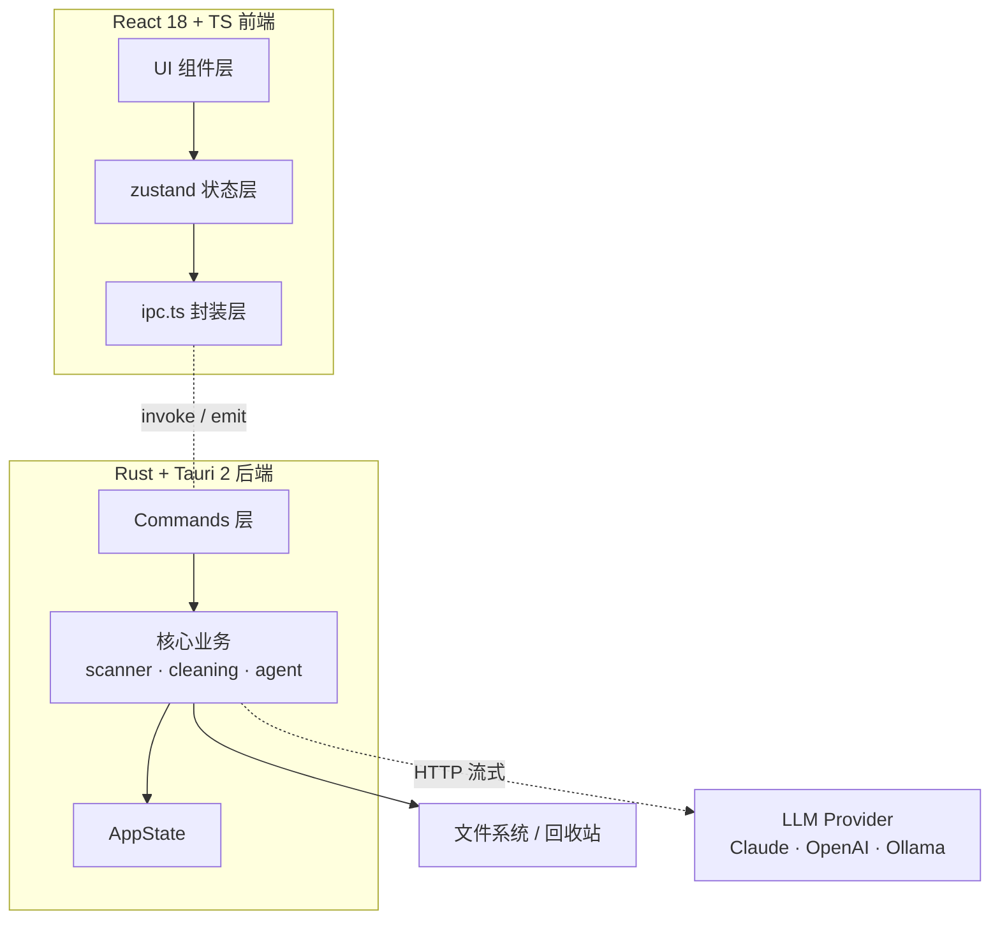

<div align="center">

#  TrueClean

**跨平台磁盘清理 + AI Agent 桌面应用 · Cross-platform disk cleaner with a built-in AI agent**

类 CleanMyMac：扫描磁盘占用 → 可视化分类占比 → 识别系统/缓存数据 → 让 AI 助手分析并（在你确认后）安全清理。

    

</div>

---

##  这是什么

TrueClean 想解决一个常见痛点：**硬盘满了，但你不知道空间被什么吃掉了，也不敢乱删。**

它做三件事：

1. **看清楚** —— 扫描整块硬盘或某个目录，把占用按类别（系统 / 应用 / 开发文件 / 媒体 / 缓存 / 日志 / 文档 / 下载 / 压缩包等）拆开，用矩形树图和旭日图直观展示，还能逐层下钻到具体文件夹。
2. **清得安全** —— 自动识别真正的「垃圾」（各类缓存、日志、临时文件、浏览器缓存、开发缓存、回收站），区分「绝对安全可删」和「需你确认」，删除默认进回收站，支持一键撤销。
3. **让 AI 帮你判断** —— 内置一个 AI 助手面板。它能**真正调用上面的扫描/分析能力**（不是空谈），帮你看「哪些能安全清理、哪些是缓存、哪些大文件可以归档」，给出预计释放空间和风险等级，并在你确认后执行清理。

>  完整产品定义见 [docs/PRD.md](docs/PRD.md)，系统架构见 [docs/ARCHITECTURE.md](docs/ARCHITECTURE.md)。

---

## ✨ 功能一览

| 功能 | 说明 | 状态 |
|---|---|---|
|  **概览** | 磁盘卷使用率环形图、容量统计、快速入口 | ✅ |
|  **磁盘扫描与可视化** | 并行递归扫描、11 类分类、Treemap + Sunburst + 文件树下钻、实时进度可取消 | ✅ |
|  **系统垃圾清理** | 9 组垃圾（缓存/日志/临时/浏览器/开发/语言缓存/回收站），组级勾选、预计释放汇总 | ✅ |
|  **大文件查找** | 按最小大小 + 未修改天数筛选大且旧的文件 | ✅ |
|  **重复文件去重** | blake3 内容哈希精确去重，按组保留 1 删其余 | ✅ |
|  **应用卸载** | 列出应用 + 连带清理残留（缓存/偏好/Support） | ✅ 基线 |
| ⚡ **启动项管理** | 列出/启停登录项、LaunchAgent | ✅ 基线 |
|  **AI 助手** | 多 Provider（Claude/OpenAI/Ollama）+ 9 工具 + 流式 + 工具调用可视化 | ✅ 基线 |
|  **安全撤销** | 默认进回收站 + `CleanManifest` 快照 + `restore_last` 一键还原 | ✅ |
|  **保护路径** | `is_protected` 硬编码红线，绝不删系统关键路径 | ✅ |

> 完成度与路线图详见 [docs/ROADMAP.md](docs/ROADMAP.md)。

<!-- 截图占位：发布后替换为真实截图 -->
<!--


-->

---

##  架构一图



> 完整架构与数据流图见 [docs/ARCHITECTURE.md](docs/ARCHITECTURE.md)。

---

##  快速开始

### 前置要求

- [Rust](https://rustup.rs)（stable，≥ 1.77）
- [Node.js](https://nodejs.org) ≥ 18
- [pnpm](https://pnpm.io)
- Linux 还需 [Tauri 系统依赖](https://tauri.app/start/prerequisites/)（webkit2gtk 等）

### 开发运行

```bash
pnpm install            # 安装前端依赖
pnpm tauri dev          # 开发模式（启动 Vite + 弹出 Tauri 窗口，首次编译约 1-2 分钟）
```

### 构建安装包

```bash
pnpm tauri build        # 产出对应平台的安装包（.dmg / .msi / .AppImage）
```

### 验证（不弹窗）

```bash
pnpm build                         # 前端类型检查 + 打包
cd src-tauri && cargo check        # 后端编译检查
cd src-tauri && cargo test --lib   # 后端单元测试
```

### 配置 AI

应用内打开「设置」：
- **Provider**：`claude`（默认）/ `openai` / `ollama`
- **Model**：如 `claude-sonnet-4-6`、`gpt-4o`、`llama3.1` 等
- 填入对应 **API Key**（Claude / OpenAI）或 **Ollama 地址**（默认 `http://localhost:11434`）

> Key 仅保存在本地配置文件，应用不上传、不内置任何密钥。详见 [docs/SECURITY.md](docs/SECURITY.md)。

📖 完整使用手册见 [docs/USER_GUIDE.md](docs/USER_GUIDE.md)。

---

##  安全设计

TrueClean 会删除文件，安全是产品存在前提：

- **删除默认走回收站**（可恢复）；永久删除需显式选择。
- **保护路径红线**：`is_protected` 硬编码三平台系统关键路径（`/System`、`/usr`、`C:\Windows` 等），`clean_paths`/`empty_trash` 强制过滤。
- **一键撤销**：`CleanManifest` 快照 + `restore_last` 还原最近一次回收站清理。
- **所有破坏性操作二次确认**：UI 弹框显示删什么、释放多少。
- **AI 安全红线**：系统提示词禁止建议删系统路径；工具内部 `is_protected` 兜底；默认 `toTrash=true`。
- **不上传用户数据**：与 LLM 只交换路径摘要 + 体积，不传文件内容。
- **API Key 仅存本地**：不内置、不上传。

详见威胁模型与安全分析：[docs/SECURITY.md](docs/SECURITY.md)。

---

##  技术栈

| 层 | 选型 |
|---|---|
| 桌面框架 | [Tauri 2](https://tauri.app)（体积小 ~10MB、原生性能、安全） |
| 后端 | Rust（并行扫描内核：jwalk / rayon / blake3 / sysinfo / trash / walkdir） |
| 前端 | React 18 + TypeScript + Vite 6 |
| 状态管理 | zustand |
| 可视化 | d3-hierarchy（Treemap / Sunburst）+ d3-shape |
| AI | 多 Provider 适配（Claude / OpenAI / Ollama）+ 工具调用 + 流式 |
| 平台 | macOS / Windows / Linux |

---

##  项目结构

```
src/                       前端（React + TS）
├── lib/        types.ts(数据真源) · ipc.ts(命令封装) · format.ts
├── store/      scanStore · agentStore · settingsStore (zustand)
├── components/ layout · scan(可视化) · cleanup · agent · ui · settings
└── styles/     tokens.css(设计令牌, 深浅双主题) · global.css

src-tauri/src/             后端（Rust + Tauri）
├── model.rs    全部 IPC 数据结构（与 types.ts 一一对应）
├── scanner/    walker · tree · categories · engine（并行扫描内核）
├── cleaning/   paths(平台路径表) · junk · large_old · trash · safety · duplicates · uninstaller · startup
├── agent/      prompt · tools(工具调用) · runner(对话循环) · providers/(claude/openai/ollama)
├── commands/   scan · cleanup · system · agent · settings（Tauri 命令）
└── state.rs    全局状态（设置 / 取消标志 / 上次扫描缓存）

docs/                      文档
├── CONTRACT.md       数据契约（单一真源）
├── AGENT_TASKS.md    多 Agent 任务书
├── PRD.md            产品需求文档
├── ARCHITECTURE.md   系统架构
├── SECURITY.md       威胁模型与安全
├── ROADMAP.md        路线图
├── USER_GUIDE.md     用户手册
└── PITCH.md          立项陈述
```

数据契约见 [`docs/CONTRACT.md`](docs/CONTRACT.md)：Rust `model.rs` 与 TS `types.ts` 为单一真源，改动需同步两侧。

---

## 🗺️ Roadmap

**已完成（基线）**
- [x] 跨平台项目骨架（Tauri 2 + React + TS），前后端均可编译
- [x] 并行磁盘扫描内核 + 分类 + 占比统计（含单元测试）
- [x] Treemap / Sunburst / 分类条 / 文件树可视化
- [x] 系统垃圾、大文件、重复文件、应用卸载、启动项的后端实现与面板
- [x] AI Agent：多 Provider + 工具调用 + 流式 + 强力提示词
- [x] 安全删除 + 保护路径 + CleanManifest 撤销
- [x] 设置（Provider / Model / Key / 回收站默认）

**进行中 / 待完善**
- [ ] Windows / Linux 的清理路径表、卸载残留、启动项管理打磨
- [ ] 真机端到端点测与 UI 五态、空态 / 错误态打磨
- [ ] 国际化（中 / 英）完善
- [ ] 应用图标与品牌视觉、打包签名 / 自动更新
- [ ] CI/CD 与 E2E 测试

详见 [docs/ROADMAP.md](docs/ROADMAP.md)。

---

##  贡献

项目处于早期，欢迎 Issue 和 PR！请先阅读 [CONTRIBUTING.md](CONTRIBUTING.md) 了解分支规范、数据契约约束与验收门禁。

- **提交规范**：`<type>(<scope>): <简述>`，如 `feat(A2): 清理核心 + 安全撤销`
- **验收门禁**：`cargo fmt/clippy/test` + `pnpm build` 全绿
- **安全红线**：删除相关逻辑改动请格外谨慎并补充测试；请勿提交任何密钥

---

##  License

MIT
