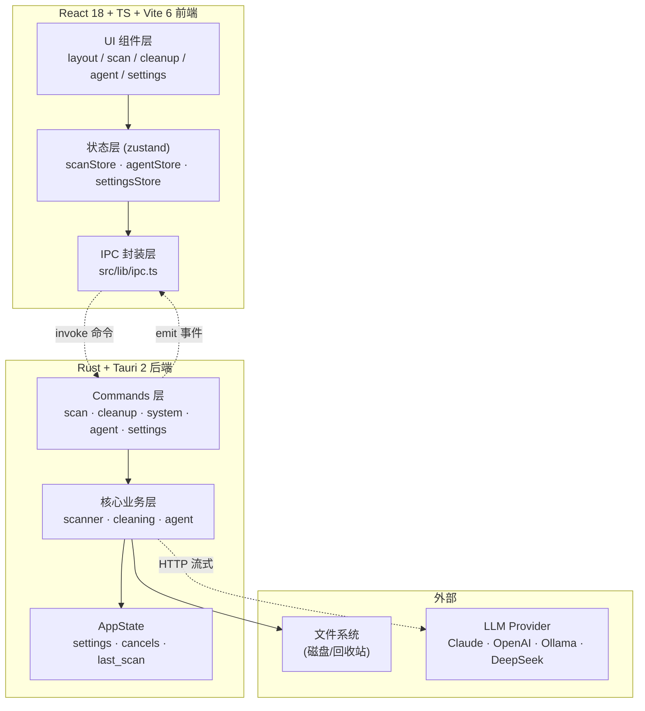

<div align="center">

# TrueClean

**跨平台磁盘清理 + AI Agent 桌面应用**

Cross-platform disk cleaner with a built-in AI agent · Tauri 2 + React 18 + Rust

</div>

> **English**: 本文件为完整中文文档。英文主文档请点击 → [English](./README.md)
>
> **中文**：本 README 为完整中文版，英文主文档可通过上方链接查看。

---

<div align="center">


</div>

---

## 目录

- [这是什么](#这是什么)
- [核心功能](#核心功能)
- [为什么选择 TrueClean](#为什么选择-trueclean)
- [系统架构](#系统架构)
- [快速开始](#快速开始)
- [配置说明](#配置说明)
- [安全模型](#安全模型)
- [AI Agent](#ai-agent)
- [技术栈](#技术栈)
- [项目结构](#项目结构)
- [测试](#测试)
- [构建](#构建)
- [路线图](#路线图)
- [贡献](#贡献)
- [许可证](#许可证)

---

## 这是什么

**TrueClean** 是一款跨平台桌面应用，帮助你安全地回收磁盘空间。它扫描磁盘、可视化占用情况、识别真正的垃圾和系统数据，并让 AI Agent 分析并执行清理——始终需要你的明确确认。

它解决一个常见痛点：**硬盘满了，但你不知道空间被什么吃掉了，也不敢乱删。**

TrueClean 做三件事：

1. **看清楚** —— 扫描整块硬盘或某个目录，把占用按类别（系统 / 应用 / 开发文件 / 媒体 / 缓存 / 日志 / 文档 / 下载 / 压缩包等）拆开，用矩形树图（Treemap）和旭日图（Sunburst）直观展示，还能逐层下钻到具体文件夹。
2. **清得安全** —— 自动识别真正的「垃圾」（各类缓存、日志、临时文件、浏览器缓存、开发缓存、回收站），区分「绝对安全可删」和「需你确认」，删除默认进回收站，支持一键撤销。
3. **让 AI 帮你判断** —— 内置一个 AI 助手面板。它能**真正调用上面的扫描/分析能力**（不是空谈），帮你看「哪些能安全清理、哪些是缓存、哪些大文件可以归档」，给出预计释放空间和风险等级，并在你确认后执行清理。

> 完整产品定义见 [docs/PRD.md](docs/PRD.md)，系统架构见 [docs/ARCHITECTURE.md](docs/ARCHITECTURE.md)

---

## 核心功能

| 功能 | 说明 | 状态 |
|---|---|---|
| **概览** | 磁盘卷使用率环形图、容量统计、快速入口 | ✅ |
| **磁盘扫描与可视化** | 并行递归扫描、11 类分类、Treemap + Sunburst + 文件树下钻、实时进度可取消 | ✅ |
| **系统垃圾清理** | 9 组垃圾（缓存/日志/临时/浏览器/开发/语言缓存/回收站），组级勾选、预计释放汇总 | ✅ |
| **大文件查找** | 按最小大小 + 未修改天数筛选大且旧的文件 | ✅ |
| **重复文件去重** | blake3 内容哈希精确去重，按组保留 1 删其余 | ✅ |
| **应用卸载** | 列出应用 + 连带清理残留（缓存/偏好/Support） | ✅ 基线 |
| **启动项管理** | 列出/启停登录项、LaunchAgent | ✅ 基线 |
| **AI 助手** | 多 Provider（Claude/OpenAI/Ollama/DeepSeek）+ 9 工具 + 流式 + 工具调用可视化 | ✅ 基线 |
| **安全撤销** | 默认进回收站 + `CleanManifest` 快照 + `restore_last` 一键还原 | ✅ |
| **保护路径** | `is_protected` 硬编码红线，绝不删系统关键路径 | ✅ |
| **密钥安全存储** | API Key 存入系统钥匙串（macOS Keychain / Windows Credential Manager / Linux Secret Service） | ✅ |
| **首次启动权限门** | 全屏权限检查，未授权前阻塞使用 | ✅ |
| **双语界面** | 中/英文切换，与 AppSettings 同步 | ✅ |
| **深色模式** | 设置中切换主题 | ✅ |

> 完成度与路线图详见 [docs/ROADMAP.md](docs/ROADMAP.md)

---

## 为什么选择 TrueClean

市面上的磁盘清理工具分两类：

- **激进型清理器**：先删后问——危及系统稳定性。
- **保守型查看器**：给你看一团乱，但清理全靠你手动。

TrueClean 占据第三位置：**透明分析 + AI 辅助判断 + 人工确认执行**。AI 永远不会自行删除任何东西。它分析、推荐、准备动作——你按下最终按钮。每个破坏性操作都受保护路径检查守护，默认进回收站，并可通过 `CleanManifest` 撤销。

---

## 系统架构

TrueClean 是 Tauri 2 桌面应用：**Rust 后端**做所有文件系统操作与 AI 编排，**React 前端**做可视化与交互，二者通过 Tauri IPC（命令 + 事件）通信。前端永远不直接访问文件系统或网络——所有能力都经后端暴露。



### 分层职责

| 层 | 职责 | 不做什么 |
|---|---|---|
| **UI 组件层** | 渲染、交互、五态（空/载/错/结果/进行） | 不直接 `invoke`，不碰文件系统 |
| **状态层 (zustand)** | 持有 UI 状态、订阅后端事件 | 不含业务逻辑 |
| **IPC 封装层 (ipc.ts)** | 类型安全的命令调用 + 事件监听 | 唯一允许 `invoke` 的地方 |
| **Commands 层** | Tauri 命令的薄包装，参数校验、状态读写 | 不含核心算法 |
| **核心业务层** | 扫描/清理/Agent 的真实算法 | 不直接 emit 事件（经 commands） |
| **AppState** | 全局共享：设置、取消标志、上次扫描缓存 | — |

> 完整架构与数据流图见 [docs/ARCHITECTURE.md](docs/ARCHITECTURE.md)

---

## 快速开始

### 前置要求

- [Rust](https://rustup.rs)（stable，≥ 1.77）
- [Node.js](https://nodejs.org) ≥ 18
- [pnpm](https://pnpm.io)
- Linux 还需 [Tauri 系统依赖](https://tauri.app/start/prerequisites/)（webkit2gtk 等）

### 开发运行

```bash
pnpm install            # 安装前端依赖
pnpm tauri dev          # 开发模式（启动 Vite + 弹出 Tauri 窗口，首次编译约 1-2 分钟）
```

### 验证（不弹窗）

```bash
pnpm build                         # 前端类型检查 + 打包
cd src-tauri && cargo check        # 后端编译检查
cd src-tauri && cargo test --lib   # 后端单元测试
```

---

## 配置说明

应用内打开「设置」：

- **Provider**：`claude`（默认）/ `openai` / `ollama` / `deepseek`
- **Model**：如 `claude-sonnet-4-6`、`gpt-4o`、`llama3.1`、`deepseek-chat`
- **API Key**：填入 Claude / OpenAI / DeepSeek 的密钥（存入系统钥匙串）
- **Base URL**：所有 Provider 支持自定义连接地址
- **Ollama 地址**：默认 `http://localhost:11434`

### 设置面板分区

设置面板分为五个区域：

1. **AI 助手** — Provider 选择、模型配置、API Key 输入（钥匙串存储）、自定义 Base URL
2. **扫描选项** — 是否跟随符号链接、是否扫描隐藏文件、最大深度、子项数量
3. **清理行为** — 默认进回收站、永久删除需显式选择
4. **外观** — 语言（中/英）和主题（浅色/深色）切换
5. **权限状态** — 完全磁盘访问 / 管理员 / 辅助程序授权状态及入口

> Key 仅保存在系统钥匙串中，应用不上传、不内置任何密钥。详见 [docs/SECURITY.md](docs/SECURITY.md)

📖 完整使用手册见 [docs/USER_GUIDE.md](docs/USER_GUIDE.md)

---

## 安全模型

TrueClean 会删除文件——安全不是附加项，而是产品存在的前提。

- **删除默认走回收站**（可恢复）；永久删除需显式选择。
- **保护路径红线**：`is_protected` 硬编码三平台系统关键路径（`/System`、`/usr`、`C:\Windows` 等），`clean_paths` / `empty_trash` 强制过滤。
- **一键撤销**：`CleanManifest` 快照 + `restore_last` 还原最近一次回收站清理。
- **所有破坏性操作二次确认**：UI 弹框显示删什么、释放多少。
- **AI 安全红线**：系统提示词禁止建议删系统路径；工具内部 `is_protected` 兜底；默认 `toTrash=true`。
- **不上传用户数据**：与 LLM 只交换路径摘要 + 体积，不传文件内容。
- **API Key 存入系统钥匙串**：不内置、不上传。
- **独立审核 Agent**：`clean_paths` 执行前，独立 LLM 审核验证路径列表是否安全可删。审核拒绝则跳过清理；审核失败（网络错误）降级为仅用户确认。

### 威胁模型

| 风险 | 严重度 | 缓解机制 | 残余风险 |
|---|---|---|---|
| R1 误删系统路径 | 致命 | `is_protected` 硬编码红线，强制过滤 | 极低 |
| R2 误删用户数据 | 高 | 默认 `to_trash=true`，UI 确认，安全/需确认区分 | 用户主动选永久删除 |
| R3 卸载残留误伤 | 中 | 卸载默认走回收站，残留受 `is_protected` 约束 | 残留路径误报 |
| R4 Agent 越权删除 | 高 | 工具默认 `toTrash=true`，`is_protected` 兜底，确认流 + 独立审核 | LLM 拒绝确认（不执行） |
| R5 API Key 泄露 | 高 | Key 存入系统钥匙串，不上传/不内置 | 本机文件被他人读取 |
| R6 路径/文件名泄露 | 中 | 工具结果只回传路径摘要 + 体积，不传文件内容 | 路径本身含敏感信息 |
| R7 永久删除无撤销 | 高 | 默认走回收站，`CleanManifest` 仅对 `to_trash` 记录 | 用户显式选永久 |

完整威胁模型与安全分析见 [docs/SECURITY.md](docs/SECURITY.md)

---

## AI Agent

内置 AI 助手是 TrueClean 的差异化功能。与只能聊天的助手不同，它可以真正**调用工具**操作你的真实扫描结果。

### 工作原理

1. **Plan-First 工作流**：Agent 先读取完整上下文并制定计划，再执行任何操作（绝不立即行动）。
2. **工具调用**：Agent 通过 Provider 的 function-calling API 调用注册的工具（扫描、分析、清理）。
3. **流式输出**：响应实时流式输出，带工具调用可视化（"正在调用 xxx" + 扫描光效）。
4. **独立审核**：任何破坏性 `clean_paths` 调用前，独立 LLM 审核验证路径安全性。
5. **人工确认**：最终清理始终需要你在对话框中明确确认，对话框会展示审核结论。

### 可用工具

| 工具 | 用途 |
|---|---|
| `scan_path` | 扫描路径并返回分类结果 |
| `list_large_files` | 列出符合大小/时间条件的大文件 |
| `list_duplicates` | 按内容哈希列出重复文件组 |
| `list_junk` | 列出识别到的垃圾文件组 |
| `list_apps` | 列出已安装应用 |
| `analyze_path` | 分析指定路径的组成 |
| `clean_paths` | 清理（回收/删除）指定路径 — **破坏性，需审核 + 确认** |
| `empty_trash` | 清空回收站 — **破坏性，需审核 + 确认** |
| `get_system_info` | 获取系统和磁盘信息 |

### 支持的 Provider

| Provider | 模型 | 需要 API Key | 自定义 Base URL |
|---|---|---|---|
| Anthropic Claude | claude-sonnet-4-6, claude-opus-4 等 | 是 | 是（默认 `https://api.anthropic.com`） |
| OpenAI | gpt-4o, gpt-4o-mini 等 | 是 | 是 |
| DeepSeek | deepseek-chat, deepseek-reasoner | 是 | 是 |
| Ollama（本地） | llama3.1, qwen2 等 | 否 | 是（默认 `http://localhost:11434`） |

---

## 技术栈

| 层 | 选型 |
|---|---|
| 桌面框架 | [Tauri 2](https://tauri.app)（体积小 ~10MB、原生性能、安全） |
| 后端 | Rust（并行扫描内核：walkdir / rayon / blake3 / sysinfo / trash） |
| 前端 | React 18 + TypeScript + Vite 6 |
| 状态管理 | zustand |
| 可视化 | d3-hierarchy（Treemap / Sunburst）+ d3-shape |
| AI | 多 Provider 适配（Claude / OpenAI / Ollama / DeepSeek）+ 工具调用 + 流式 |
| 安全存储 | keyring（macOS Keychain / Windows Credential Manager / Linux Secret Service） |
| 平台 | macOS / Windows / Linux |

---

## 项目结构

```
TrueClean/
├── .github/                    GitHub 配置
│   ├── workflows/              CI/CD 流水线（ci.yml, release.yml）
│   ├── ISSUE_TEMPLATE/         Issue 模板
│   └── pull_request_template.md
├── docs/                       文档
│   ├── PRD.md                  产品需求文档
│   ├── ARCHITECTURE.md         系统架构
│   ├── SECURITY.md             威胁模型与安全
│   ├── CONTRACT.md             数据契约（单一真源）
│   ├── ROADMAP.md              路线图
│   ├── USER_GUIDE.md           用户手册
│   ├── CI_CD.md                CI/CD 文档
│   ├── ACCEPTANCE_CHECKLIST.md 验收清单
│   └── PITCH.md                立项陈述
├── src/                        前端（React + TS）
│   ├── components/             UI 组件
│   │   ├── layout/             TopBar, Sidebar, BottomBar, PermissionGate
│   │   ├── scan/               BubbleMap, CategoryBar, ScanView, ScanProgress
│   │   ├── agent/              AgentPanel, MessageList, Composer, ToolCallCard
│   │   ├── settings/           SettingsPanel
│   │   └── ui/                 Button, Toast, ErrorBoundary 等
│   ├── store/                  zustand 状态（scan, agent, clean, settings）
│   ├── hooks/                  useAgent, usePermissions, useScan, useTheme
│   ├── lib/                    types.ts, ipc.ts, format.ts, lens-utils.ts
│   ├── i18n/                   国际化（zh / en）
│   └── styles/                 tokens.css, global.css
├── src-tauri/                  后端（Rust + Tauri）
│   ├── src/
│   │   ├── model.rs            全部 IPC 数据结构（与 types.ts 一一对应）
│   │   ├── scanner/            walker, tree, categories, engine（并行扫描内核）
│   │   ├── cleaning/           paths, junk, large_old, trash, safety, duplicates, uninstaller, startup
│   │   ├── agent/              prompt, tools, runner, providers/（claude/openai/ollama/deepseek）
│   │   ├── commands/           scan, cleanup, system, agent, settings（Tauri 命令）
│   │   ├── permissions.rs      权限检测（FDA/Admin/Helper）
│   │   ├── secrets.rs          系统钥匙串安全存储
│   │   └── state.rs            全局状态（设置 / 取消标志 / 上次扫描缓存）
│   ├── Cargo.toml
│   ├── tauri.conf.json
│   └── icons/                  应用图标
├── tests/                      E2E 测试与测试配置
├── package.json
├── LICENSE
├── CONTRIBUTING.md
└── README.md
```

> 数据契约：Rust `model.rs` 与 TS `types.ts` 为单一真源，改动需同步两侧。详见 [docs/CONTRACT.md](docs/CONTRACT.md)

---

## 测试

TrueClean 在两层都维护了完整的测试套件：

```bash
# 后端（Rust）
cd src-tauri
cargo test --lib              # 单元测试（160+ 个）
cargo clippy --all-targets -- -D warnings   # Lint（零警告）
cargo fmt --all -- --check    # 格式检查

# 前端（TypeScript）
pnpm test                     # Vitest 单元测试（83+ 个）
pnpm lint                     # ESLint（零错误）
pnpm build                    # TypeScript 类型检查 + Vite 构建
```

### 测试覆盖

- **后端**：160+ 单元测试，覆盖 scanner、cleaning、agent、providers、safety、permissions
- **前端**：83+ 单元测试，覆盖 stores、hooks、工具函数、组件
- **CI**：在 macOS、Ubuntu、Windows 三平台运行 `cargo fmt`、`cargo clippy -D warnings`、`cargo test`、`pnpm lint`、`pnpm test`、`pnpm build`

---

## 构建

### 构建安装包

```bash
pnpm tauri build        # 产出对应平台的安装包（.dmg / .msi / .AppImage）
```

构建产物输出到 `src-tauri/target/release/bundle/`。

### Release 配置

Release 配置针对小体积优化：

```toml
[profile.release]
opt-level = "s"
lto = true
codegen-units = 1
panic = "abort"
strip = true
```

---

## 路线图

**已完成（基线）**

- [x] 跨平台项目骨架（Tauri 2 + React + TS），前后端均可编译
- [x] 并行磁盘扫描内核 + 分类 + 占比统计（含单元测试）
- [x] Treemap / Sunburst / 分类条 / 文件树可视化
- [x] 系统垃圾、大文件、重复文件、应用卸载、启动项的后端实现与面板
- [x] AI Agent：多 Provider + 工具调用 + 流式 + 强力系统提示词
- [x] 安全删除 + 保护路径 + CleanManifest 撤销
- [x] 设置（Provider / Model / Key / 回收站默认 / 扫描选项 / 外观）
- [x] API Key 安全存入系统钥匙串
- [x] 首次启动权限门
- [x] 破坏性清理前的独立审核 Agent
- [x] macOS APFS firmlink 去重修复（防止 200GB 盘扫出 10TB）
- [x] 双语界面（中/英）与设置同步

**进行中 / 待完善**

- [ ] Windows / Linux 的清理路径表、卸载残留、启动项管理打磨
- [ ] 真机端到端测试与 UI 五态、空态/错误态打磨
- [ ] 应用图标与品牌视觉、打包签名 / 自动更新
- [ ] E2E 测试套件扩充

详见 [docs/ROADMAP.md](docs/ROADMAP.md)

---

## 贡献

项目处于早期开发，欢迎 Issue 和 PR！请先阅读 [CONTRIBUTING.md](CONTRIBUTING.md) 了解分支规范、数据契约约束与验收门禁。

- **提交规范**：`<type>(<scope>): <简述>`，如 `feat(scan): add firmlink dedup`
- **验收门禁**：`cargo fmt` / `cargo clippy` / `cargo test` + `pnpm build` 全绿
- **安全红线**：删除相关逻辑改动请格外谨慎并补充测试；请勿提交任何密钥

### 开发流程

1. Fork 仓库并创建功能分支
2. 遵循数据契约修改（同步 `model.rs` 和 `types.ts`）
3. 运行完整验证套件（fmt, clippy, test, lint, build）
4. 提交 PR 并关联相关 Issue

---

## 许可证

[MIT](LICENSE) © TrueClean
