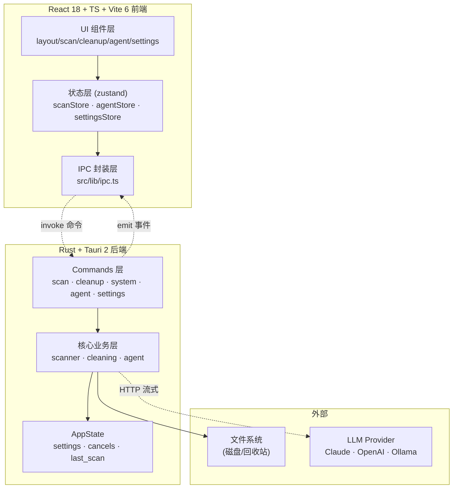
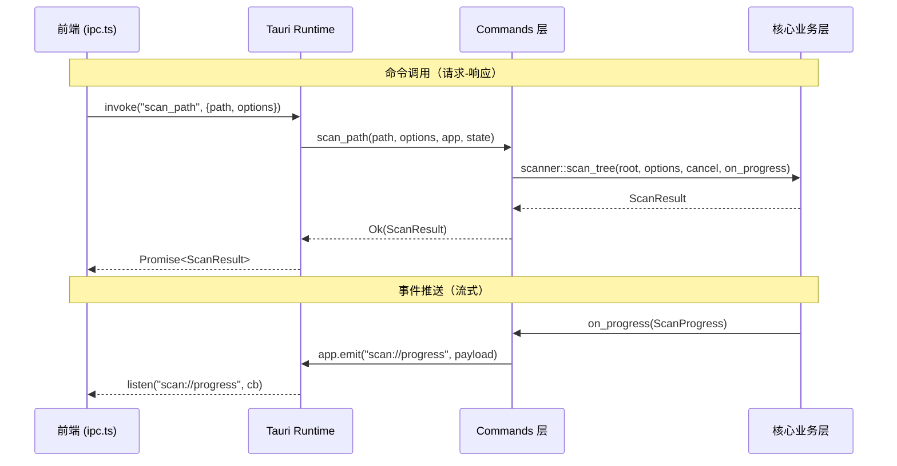
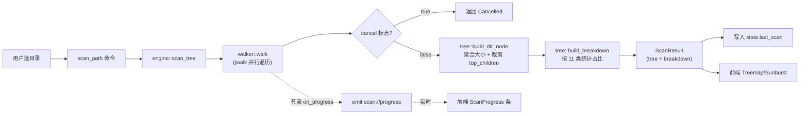
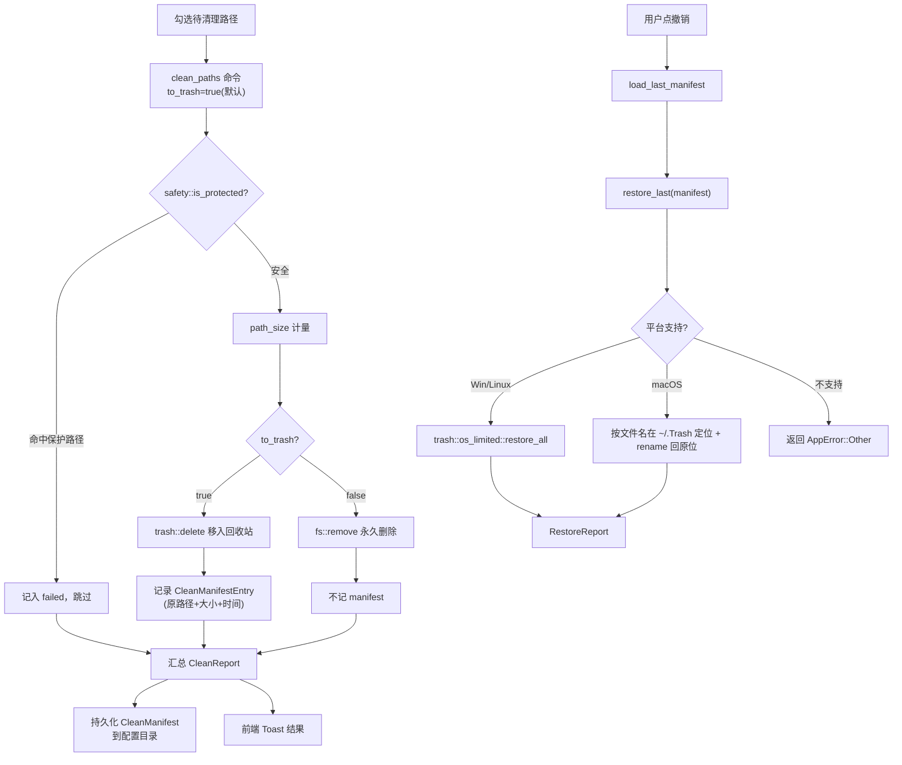
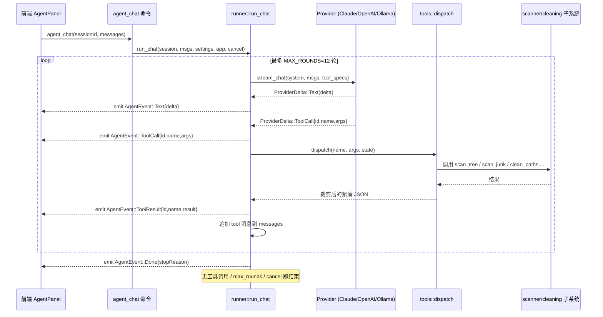
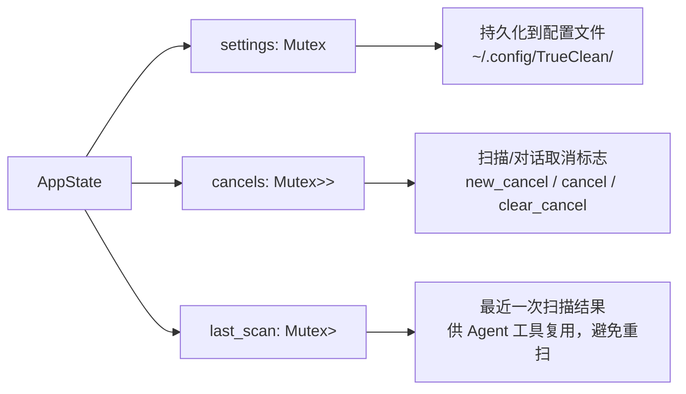

# TrueClean — 系统架构文档

> 版本：0.1.0 · 最后更新：2026-06-18
> 数据契约单一真源：[CONTRACT.md](CONTRACT.md) · 配套：[PRD.md](PRD.md) · [SECURITY.md](SECURITY.md)

---

## 1. 架构总览

TrueClean 是 Tauri 2 桌面应用：**Rust 后端**做所有文件系统操作与 AI 编排，**React 前端**做可视化与交互，二者通过 Tauri IPC（命令 + 事件）通信。前端永远不直接访问文件系统或网络 API——所有能力都经后端暴露。

### 分层职责

| 层 | 职责 | 不做什么 |
|---|---|---|
| **UI 组件层** | 渲染、交互、五态（空/载/错/结果/进行） | 不直接 `invoke`，不碰文件系统 |
| **状态层 (zustand)** | 持有 UI 状态、订阅后端事件 | 不含业务逻辑 |
| **IPC 封装层 (ipc.ts)** | 类型安全的命令调用 + 事件监听 | 唯一允许 `invoke` 的地方 |
| **Commands 层** | Tauri 命令的薄包装，参数校验、状态读写 | 不含核心算法 |
| **核心业务层** | 扫描/清理/Agent 的真实算法 | 不直接 emit 事件（经 commands） |
| **AppState** | 全局共享：设置、取消标志、上次扫描缓存 | — |

---

## 2. IPC 契约

所有命令返回 `Result<T, AppError>`，前端 catch 到的是 `{ message: string }`（见 `error.rs`）。命令名与签名冻结，详见 [CONTRACT.md §2](CONTRACT.md)。

### 命令清单

| 命令 | 模块 | 作用 |
|---|---|---|
| `get_volumes` | scan | 列出磁盘卷与容量 |
| `scan_path` | scan | 全盘/目录递归扫描，流式发 `scan://progress` |
| `cancel_scan` | scan | 取消进行中的扫描 |
| `scan_junk` | cleanup | 扫描系统垃圾分组 |
| `find_large_old_files` | cleanup | 查找大且旧的文件 |
| `clean_paths` | cleanup | 删除路径（默认进回收站） |
| `empty_trash` | cleanup | 清空回收站 |
| `find_duplicates` | system | blake3 内容哈希去重 |
| `list_applications` | system | 列出已安装应用 |
| `uninstall_app` | system | 卸载应用 + 清残留 |
| `list_startup_items` | system | 列出启动项 |
| `set_startup_item` | system | 启停启动项 |
| `agent_chat` | agent | 流式对话 + 工具循环 |
| `agent_cancel` | agent | 取消进行中的对话 |
| `get_settings` / `save_settings` | settings | 读写持久化设置 |

### 事件清单

| 事件名 | 载荷 | 触发时机 |
|---|---|---|
| `scan://progress` | `ScanProgress` | 扫描过程中节流推送 |
| `agent://event/{sessionId}` | `AgentEvent` (tagged enum) | Agent 流式输出每个增量 |

---

## 3. 扫描数据流

**关键设计**：
- **并行遍历**：`jwalk` + `rayon` 并行遍历目录，大目录（50 万+ 文件）不阻塞。
- **进度节流**：`on_progress` 按时间/文件数聚合，避免每个文件都 emit 刷爆前端。
- **取消**：`AtomicBool` 在遍历粒度检查，取消快速干净返回 `AppError::Cancelled`。
- **健壮性**：无权限目录、符号链接环、超长路径跳过而非崩溃，`ScanStats` 计数跳过/报错项。
- **裁剪**：每个 `DirNode` 只保留 `top_children`（默认 20）个最大子项，`truncated_children` 记录省略数。
- **缓存指纹**：`fingerprint()` 用根 mtime + 子项名哈希判断是否可复用 `state.last_scan`。

---

## 4. 清理数据流

**安全机制（详见 [SECURITY.md](SECURITY.md)）**：
- `is_protected` 在 `clean_paths` 与 `empty_trash` 执行前**强制**过滤，命中即拒绝并记入 `failed`。
- `to_trash=true` 时生成 `CleanManifest` 快照，持久化到 `~/.config/TrueClean/clean_manifest.json`。
- `restore_last` 在 macOS 用 `~/.Trash` 按名匹配 + `rename` 还原；Windows/Linux 用 `trash::os_limited::restore_all`。
- 单条失败不中断整体清理。

---

## 5. AI Agent 数据流

### Agent 工具集（9 个）

| 工具 | 类型 | 说明 |
|---|---|---|
| `list_volumes` | 只读 | 列出磁盘卷与容量 |
| `scan_directory` | 只读 | 扫描目录，返回分类占比 + top 子项摘要 |
| `scan_junk` | 只读 | 列出可清理垃圾分组 |
| `find_large_old_files` | 只读 | 查找大且旧的文件 |
| `find_duplicates` | 只读 | blake3 哈希去重 |
| `list_applications` | 只读 | 列出已安装应用 |
| `list_startup_items` | 只读 | 列出启动项 |
| `clean_paths` | **破坏性** | 删除路径（默认 toTrash=true） |
| `empty_trash` | **破坏性** | 清空回收站 |

**结果裁剪**：`tools::dispatch` 把结果压成 LLM 友好的紧凑 JSON——列表截断到 `LIST_CAP=30` 项并附总数、体积用字节、`scan_directory` 只返回分类占比 + top 子项而非整棵树。

**防失控**：`MAX_ROUNDS=12` 硬上限；`cancel` 标志每轮检查；取消时发 `Done{stopReason:"cancelled"}`。

---

## 6. 关键模块职责

```mermaid
graph LR
    subgraph scanner["scanner/ 扫描内核"]
        walker["walker.rs<br/>jwalk 并行遍历"]
        engine["engine.rs<br/>编排 + 指纹缓存"]
        tree["tree.rs<br/>DirNode 构建 + 分类统计"]
        cats["categories.rs<br/>11 类路径判定"]
    end
    subgraph cleaning["cleaning/ 清理核心"]
        paths["paths.rs<br/>平台路径表"]
        junk["junk.rs<br/>9 组垃圾扫描"]
        large["large_old.rs<br/>大文件筛选"]
        dup["duplicates.rs<br/>blake3 去重"]
        uninst["uninstaller.rs<br/>应用卸载"]
        startup["startup.rs<br/>启动项"]
        trash["trash.rs<br/>删除+撤销"]
        safety["safety.rs<br/>保护路径红线"]
    end
    subgraph agent["agent/ AI 引擎"]
        prompt["prompt.rs<br/>中文系统提示词"]
        tools["tools.rs<br/>9 工具定义+dispatch"]
        runner["runner.rs<br/>对话循环编排"]
        provs["providers/<br/>claude·openai·ollama"]
    end
    subgraph commands["commands/ IPC 薄包装"]
        scan_c["scan.rs"]
        clean_c["cleanup.rs"]
        sys_c["system.rs"]
        agent_c["agent.rs"]
        set_c["settings.rs"]
    end

    commands --> scanner
    commands --> cleaning
    commands --> agent
    agent --> scanner
    agent --> cleaning
    cleaning --> safety
    trash --> safety
```

### 模块说明

| 模块 | 职责 | 关键函数 |
|---|---|---|
| `scanner/engine` | 扫描编排、缓存指纹 | `scan_tree`, `fingerprint` |
| `scanner/walker` | 并行遍历、跳过/计数 | `walk` |
| `scanner/tree` | DirNode 构建、分类统计 | `build_dir_node`, `build_breakdown` |
| `scanner/categories` | 路径→类别判定 | `classify` |
| `cleaning/safety` | 保护路径红线 | `is_protected`, `split_protected` |
| `cleaning/trash` | 删除 + 快照 + 撤销 | `clean_paths`, `empty_trash`, `restore_last` |
| `cleaning/paths` | 平台路径表（9 类） | `user_cache_dirs`, `browser_cache_dirs` 等 |
| `cleaning/junk` | 9 组垃圾扫描 | `scan_junk` |
| `cleaning/duplicates` | blake3 去重 | `find_duplicates` |
| `cleaning/uninstaller` | 应用列出 + 卸载 | `list_applications`, `uninstall_app` |
| `agent/runner` | 对话循环 | `run_chat` |
| `agent/tools` | 工具定义 + 分发 | `tool_specs`, `dispatch` |
| `agent/providers/*` | 三 Provider 流式适配 | `stream_chat` |

---

## 7. 技术选型理由

| 选型 | 理由 |
|---|---|
| **Tauri 2** | 安装包 ~10MB（Electron 动辄 100MB+）；Rust 后端原生性能；安全模型严格（capabilities 权限）。 |
| **Rust 后端** | 文件系统操作要快且安全：`jwalk`/`rayon` 并行、`blake3` 极速哈希、`trash` 跨平台回收站、零成本抽象无 GC 停顿。 |
| **React 18 + TS + Vite 6** | 生态成熟、类型安全、Vite HMR 极快；zustand 轻量（<1KB）够用，不引入 Redux 复杂度。 |
| **d3-hierarchy** | Treemap/Sunburst 是磁盘占用的最佳可视化；d3 生态稳定、可定制。 |
| **多 Provider 架构** | 不锁定单一 AI 厂商：Claude 质量高、OpenAI 通用、Ollama 本地零成本。中立 `tool_specs` + 各 Provider 适配层，新增 Provider 只加一个文件。 |
| **BYOK（自带 Key）** | 不内置密钥 = 不承担代售/抽成/泄露责任；用户数据与 LLM 之间只传摘要（路径/体积），不上传文件内容。 |
| **trash crate + CleanManifest** | 删除默认可撤销是"信任的基石"；`trash` crate 跨平台调系统回收站，`CleanManifest` 记录快照供 `restore_last`。 |

---

## 8. 数据模型

数据契约冻结：`src-tauri/src/model.rs` 与 `src/lib/types.ts` 字段一一对应、`camelCase`。改动需同步两侧 + [CONTRACT.md](CONTRACT.md)。核心结构：

- **扫描**：`VolumeInfo` · `ScanOptions` · `ScanProgress` · `ScanResult`(含 `DirNode` 树 + `CategoryBreakdown`)
- **清理**：`JunkGroup`/`JunkItem` · `DuplicateGroup` · `FileEntry` · `CleanReport`
- **系统**：`AppInfo` · `UninstallReport` · `StartupItem`
- **Agent**：`ChatMessage` · `AgentEvent`(tagged enum: Text/ToolCall/ToolResult/Done/Error)
- **设置**：`AppSettings`(provider/model/keys/language/default_to_trash)

完整定义见 [CONTRACT.md §1](CONTRACT.md) 与源文件。

---

## 9. 全局状态（AppState）

`state.rs` 持有三块共享状态（`Mutex` 保护）：

---

## 10. 构建与发布

| 命令 | 作用 |
|---|---|
| `pnpm install` | 安装前端依赖 |
| `pnpm tauri dev` | 开发模式（Vite + Tauri 窗口） |
| `pnpm build` | 前端 `tsc --noEmit && vite build` |
| `pnpm tauri build` | 产出平台安装包（.dmg/.msi/.AppImage） |
| `cd src-tauri && cargo test --lib` | 后端单元测试 |
| `cd src-tauri && cargo clippy -- -D warnings` | 后端 lint |

Release profile 已优化：`opt-level="s"` + `lto=true` + `codegen-units=1` + `strip=true`，保证安装包小。
