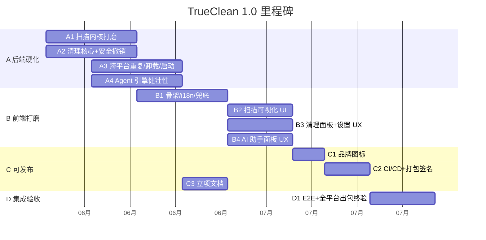

# TrueClean — 产品路线图

> 版本：0.1.0 · 最后更新：2026-06-18
> 配套：[PRD.md](PRD.md) · [AGENT_TASKS.md](AGENT_TASKS.md) · [USER_GUIDE.md](USER_GUIDE.md)

本路线图把 TrueClean 从「可编译基线」推进到「可立项、可发布、可信赖的 1.0」，并展望 1.0 之后的方向。里程碑对照 [AGENT_TASKS.md](AGENT_TASKS.md) 的 A~D 波次。

---

## 当前基线（Baseline · 已完成）

基线 commit `305b1e7`（master），已验证 `cargo check` + `pnpm build` + scanner 单元测试全绿。

| 能力 | 状态 |
|---|---|
| Tauri 2 + React 18 + TS 跨平台骨架 | 完成 |
| 并行扫描内核（取消/节流/健壮性/分类/指纹缓存） | 生产级 |
| 清理核心 + 安全快照/撤销（is_protected + CleanManifest + restore_last） | 生产级 |
| 系统垃圾/大文件/重复/卸载/启动项 后端实现 | 基线 |
| AI Agent（多 Provider + 9 工具 + 流式 + 工具循环 + 强力提示词） | 基线 |
| 前端面板（概览/扫描/清理/Agent/设置） | 基线 |

---

## 里程碑总览

---

## M1 — 后端硬化（波次 A）

> 目标：把后端从「能跑」提升到「生产级」，前端依赖稳定的命令行为。同波次文件零重叠，可完全并行。

### A1 — 扫描内核：性能 / 取消 / 缓存 / 测试 ✅ 已完成

- 取消正确性：`AtomicBool` 细粒度检查，中途取消干净返回 `Cancelled`，不 panic 不留半成品。
- 进度节流：`scan://progress` 按时间/文件数聚合，避免刷爆前端。
- 性能：`jwalk`/`rayon` 并行，大目录（50 万+ 文件）不爆内存。
- 健壮性：无权限目录、符号链接环、超长路径跳过并计数（`ScanStats`）。
- 缓存指纹：`fingerprint()` + `fingerprint_changed()` 判断是否可复用 `state.last_scan`。
- 分类：`classify` 覆盖 11 类，表驱动测试。

**验收**：`cargo fmt/clippy/test` 全绿；取消/分类/指纹/跳过计数有单元测试。

### A2 — 清理核心 + 安全快照/撤销 ✅ 已完成

- **安全红线**：`cleaning/safety.rs` 的 `is_protected` 硬编码三平台保护路径表，`clean_paths`/`empty_trash` 强制过滤。
- **撤销/快照**：`CleanManifest` 记录被移入回收站的路径 + 体积 + 时间，`restore_last` 还原。macOS 按 `~/.Trash` 文件名匹配，Windows/Linux 用 `trash::os_limited::restore_all`。
- `clean_paths`：永久删除先过 `is_protected`；单条失败不中断；统计进 `CleanReport`。
- `junk.rs`：9 组垃圾的"推荐清理"标记保守正确；体积统计并行。
- `paths.rs`：三平台候选路径补全（浏览器缓存 Chrome/Edge/Brave/Firefox、语言缓存 npm/pip/cargo/gradle）。

**验收**：`is_protected`、`restore`、clean 统计均有测试；保护路径表可审计。

### A3 — 跨平台：重复 / 卸载 / 启动项 🚧 进行中

- `duplicates.rs`：blake3 内容哈希去重，0 字节/硬链接/权限不足处理合理，并行可取消。
- `uninstaller.rs`：三平台列出应用（macOS .app + Info.plist / Windows 注册表 / Linux .desktop）；卸载连带清残留，默认走回收站，受 `is_protected` 约束。
- `startup.rs`：三平台列出/启停启动项（macOS LaunchAgents / Windows 注册表 Run / Linux autostart + systemd）。
- 非本机平台分支可编译，未实现返回空列表或 `AppError::Unsupported`。

### A4 — AI Agent 引擎：健壮性 / 工具安全 / 确认流 🚧 进行中

- Provider 健壮性：HTTP 超时、429/5xx 指数退避重试、错误体映射中文提示、流式解析容错。
- 工具安全：`dispatch` 里 `clean_paths`/`empty_trash` 经 `is_protected` 校验，默认 `toTrash=true`，结果裁剪紧凑 JSON。
- 确认流：破坏性工具执行前经 `AgentEvent` 让前端确认。
- `prompt.rs`：强化中文系统提示词（主动用工具、不编造、三组输出、安全红线）。
- 测试：dispatch 参数解析/裁剪、provider 错误映射/流式解析（mock，不联网）。

---

## M2 — 前端打磨（波次 B）

> 目标：UI 五态齐全、中英 i18n、设计质感、确认/校验交互完善。依赖 M1 后端稳定。B1 先落地 i18n 框架，B2/B3/B4 填命名空间。

### B1 — 前端骨架 / 设计系统 / i18n / 兜底 🚧 进行中

- i18n 框架（`src/i18n/*`）：`locale = 'zh' | 'en'`，`useI18n()`/`t(key)`，语言存 localStorage + zustand。
- 全局兜底：React ErrorBoundary（崩溃中文兜底 + 重试）、Toast 通知系统。
- 设计质量：层次/留白/深浅双主题/hover-focus-active 设计感，Overview 信息层级。
- 首次运行引导：空态/引导（三步：扫描→识别→AI 清理）。
- 无障碍：语义化标签、aria-label、键盘可达。

### B2 — 扫描可视化 UI 🚧 待开始

- 五态：未扫描/扫描中/完成/空结果/出错。
- Treemap/Sunburst 配色一致、hover tooltip、点击下钻、FileTree 面包屑。
- 取消即时反馈；进度平滑展示不抖动。
- `@tauri-apps/plugin-dialog` 选目录；`format.ts` 人类可读数字；响应式 960~1920。

### B3 — 清理面板 + 设置 UX 🚧 待开始

- 二次确认：所有破坏性操作弹确认框（删 N 项 / 释放 X / 是否进回收站），默认进回收站。
- 五态：加载中/空/出错/结果/进行中。
- 勾选汇总：组级/项级联动、底部实时汇总；大文件按筛选；重复按组保留 1；卸载显示残留；启动项启停。
- 设置校验：Provider 切换联动 Model；Key 密码态可显隐；"测试连接"按钮；明确告知"Key 仅存本地"。

### B4 — AI 助手面板 UX 🚧 待开始

- 流式：监听 `agent://event/{sessionId}`，增量渲染、自动滚动、可中断。
- 工具调用可视化：`ToolCallCard` 展示工具+参数+结果摘要，可折叠，区分进行中/完成/失败。
- 破坏性确认：Agent 想执行清理时前端弹确认/拒绝。
- 体验：未配 key 引导去设置；多行输入 Enter 发送/Shift+Enter 换行；空会话示例提问。

---

## M3 — 可发布（波次 C）

> 目标：品牌视觉、CI/CD、打包签名、自动更新、立项文档。C3 文档独立可并行。

### C1 — 品牌视觉与图标 🚧 待开始

- 全平台图标集（32/128/128@2x/512/icns/ico）。
- 基础品牌：主色、Logo、slogan、brand 说明。
- 不引入构建期重依赖。

### C2 — CI/CD + 代码规范 + 打包/签名/自动更新 🚧 待开始

- ESLint + Prettier + rustfmt + clippy 配置；`package.json` 加 lint/format 脚本。
- GitHub Actions `ci.yml`：PR 触发，前端 tsc+vite+eslint，后端 fmt+clippy+test，三平台矩阵。
- `release.yml`：打 tag 时 tauri-action 三平台构建（.dmg/.msi/.AppImage/.deb），上传 Release。
- `tauri-plugin-updater` 接入自动更新（endpoints/pubkey 占位）。
- 签名 secrets 文档（APPLE_*/WINDOWS_*）。

### C3 — 立项文档与产品材料 ✅ 本次完成

- [PRD.md](PRD.md) · [ARCHITECTURE.md](ARCHITECTURE.md) · [SECURITY.md](SECURITY.md) · [ROADMAP.md](ROADMAP.md) · [USER_GUIDE.md](USER_GUIDE.md) · [PITCH.md](PITCH.md)
- [README.md](../README.md) 更新真实状态 · [CONTRIBUTING.md](../CONTRIBUTING.md) 贡献指南

---

## M4 — 集成验收（波次 D）

> 目标：E2E + 全平台出包终验，对照「可立项清单」全绿。前置：A/B/C 均合并。

### D1 — 集成验收 / E2E / 全平台出包终验 🚧 待开始

- E2E（Playwright + Tauri 或 Vite dev 冒烟）：启动→概览→扫描→可视化→垃圾→勾选→确认清理→Toast；AI 面板→提问→工具卡→建议；设置切 Provider/语言。
- 全量构建：`pnpm tauri build` 三平台出包成功。
- 集成 bug 修复：跨模块联调（事件名/字段/时序/空态），契约不破。
- 可立项终验清单逐项核对。
- 产出 `docs/RELEASE_CHECKLIST.md` + 《验收报告》。

---

## 1.0 发布标准（Definition of Done）

1.0 必须满足以下全部条件：

| 类别 | 标准 |
|---|---|
| **功能** | 扫描/可视化/系统垃圾/大文件/重复/卸载/启动项/AI Agent 全部可用 |
| **平台** | macOS/Windows/Linux 三平台可出包，清理路径表覆盖主流场景 |
| **安全** | 删除默认进回收站；`is_protected` 生效；撤销可用；破坏性操作前端二次确认 + Agent 确认流 |
| **UI** | 五态（空/载/错/结果/进行）齐全；中英 i18n 完整；深浅双主题 |
| **AI** | 三 Provider 可配置 + 超时重试 + 流式 + 工具调用 + 确认流 |
| **工程** | CI/release workflow 存在；`cargo fmt/clippy/test` + `pnpm build + lint` 全绿；`tauri build` 出包带图标 |
| **文档** | PRD/架构/威胁模型/路线图/用户手册/README/CONTRIBUTING 齐全 |
| **质量** | 无硬编码密钥、无 console.log、无 TODO/stub 残留 |

---

## 1.0 后展望（Post-1.0 Vision）

### v1.x — 深化与扩展

| 方向 | 说明 |
|---|---|
| **增量扫描** | 基于文件系统事件（FSEvents/inotify）的实时增量，避免全量重扫 |
| **清理规则插件** | 社区贡献的清理规则包（YAML 声明路径模式 + 安全等级），经审核入库 |
| **计划清理** | 定时自动清理缓存/日志（可配置周期与阈值） |
| **磁盘健康监测** | SMART 数据读取 + 异常告警 |
| **网络存储扫描** | SMB/NFS 挂载卷扫描支持 |

### v2.0 — 智能化

| 方向 | 说明 |
|---|---|
| **本地模型深度集成** | Ollama 一键安装引导 + 推荐模型 + 零成本隐私优先模式 |
| **清理效果学习** | 基于用户历史勾选行为，个性化"推荐清理"标记 |
| **多机协同** | 局域网内多台机器的磁盘概览（可选，纯本地 P2P） |
| **企业版** | 集中配置、审计日志、策略下发（独立发行） |

### 持续原则

- **永远不开源核心安全逻辑的妥协**：`is_protected` 与撤销机制始终开源可审计。
- **永远不上传用户文件内容**：隐私是产品底线。
- **永远 BYOK**：不代售 API Key，不锁定 Provider。

---

## 风险与依赖

| 风险 | 影响 | 缓解 |
|---|---|---|
| macOS `trash` crate 限制（无 `os_limited`） | 还原按文件名匹配，同名冲突 | 文档说明限制；未来解析 Trash 元数据 |
| Windows 注册表卸载残留 | 残留清理可能不全 | 保守清理 + 显示残留供复核 |
| LLM Provider 稳定性 | Agent 不可用 | 三 Provider 可切换 + Ollama 本地兜底 |
| 跨平台 CI 成本 | 三平台矩阵构建慢 | 缓存 cargo/pnpm；按需触发 |
