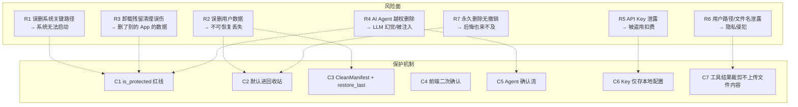
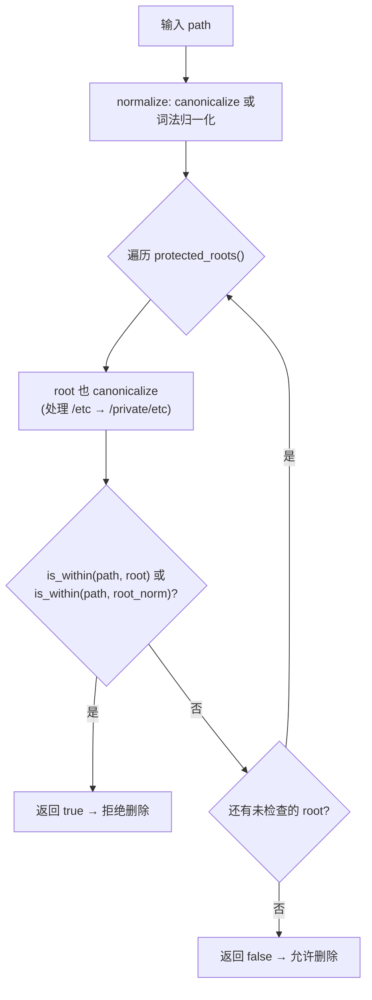
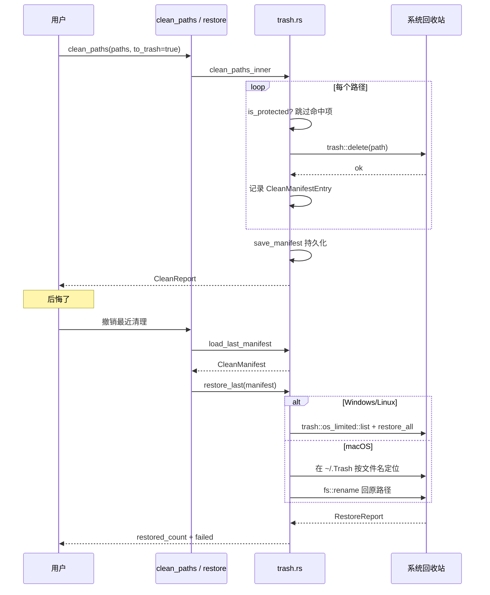
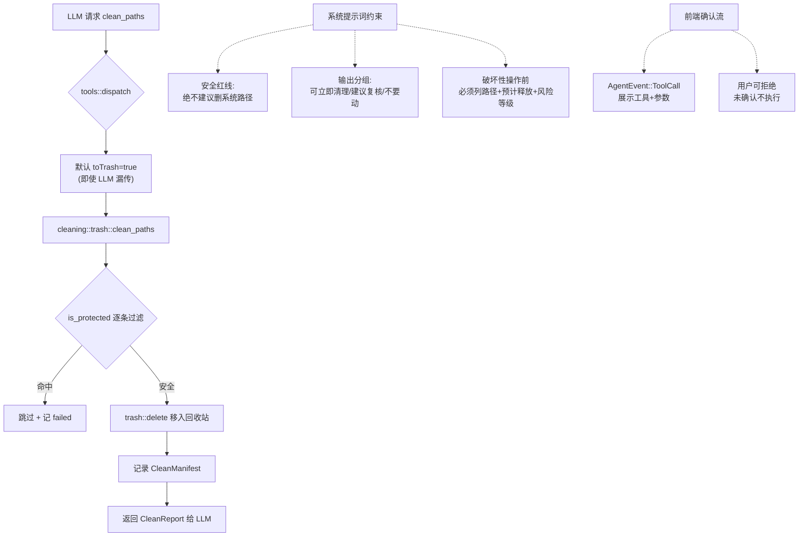
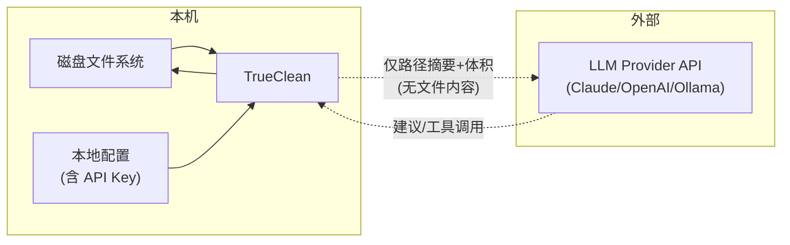

# TrueClean — 安全模型与威胁分析

> 版本：0.1.0 · 最后更新：2026-06-18
> 配套：[ARCHITECTURE.md](ARCHITECTURE.md) · [PRD.md](PRD.md) · [CONTRACT.md](CONTRACT.md)

TrueClean 是一款会**删除文件**的桌面应用。这意味着安全不是附加项，而是产品的存在前提。本文档定义风险面、保护机制与隐私承诺。

---

## 1. 威胁模型（Threat Model）



### 风险与缓解对照

| 风险 | 严重度 | 缓解机制 | 残余风险 |
|---|---|---|---|
| **R1 误删系统路径** | 致命 | `is_protected` 硬编码红线，`clean_paths`/`empty_trash` 强制过滤 | 极低（需绕过函数） |
| **R2 误删用户数据** | 高 | 默认 `to_trash=true`；UI 二次确认；区分"安全可删/需确认" | 用户主动选永久删除时 |
| **R3 卸载残留误伤** | 中 | 卸载默认走回收站；残留路径受 `is_protected` 约束 | 残留路径判定误报 |
| **R4 Agent 越权删除** | 高 | 工具默认 `toTrash=true`；`is_protected` 兜底；前端确认流 | LLM 拒绝确认（不执行） |
| **R5 API Key 泄露** | 高 | Key 仅存本地配置文件，不上传、不内置 | 本机文件被他人读取 |
| **R6 路径/文件名泄露** | 中 | 工具结果只回传路径摘要 + 体积，不上传文件内容 | 路径本身含敏感信息 |
| **R7 永久删除无撤销** | 高 | 默认走回收站；`CleanManifest` 仅对 `to_trash` 记录 | 用户显式选永久删除 |

---

## 2. 保护路径机制（is_protected）

`cleaning/safety.rs` 是所有破坏性操作的**单一安全闸门**。`clean_paths` 与 `empty_trash` 在执行任何删除前**必须**调用 `is_protected(path)`，命中即跳过并记入 `failed`，绝不删除。

### 保护路径表（硬编码、可审计）

| 平台 | 保护路径 |
|---|---|
| **macOS** | `/System` · `/usr` · `/bin` · `/sbin` · `/Library/Apple` · `/dev` · `/etc` · `/private/etc` |
| **Windows** | `C:\Windows` · `C:\Program Files` · `C:\Program Files (x86)` · `C:\ProgramData` · `C:\Recovery` |
| **Linux** | `/usr` · `/bin` · `/sbin` · `/etc` · `/boot` · `/dev` · `/proc` · `/sys` · `/lib` · `/lib64` |

### 设计要点

1. **组件边界比较**：`is_within` 按 path component 比较，`/System` 不会误匹配 `/SystemFoo`。
2. **符号链接解析**：`normalize` 优先 `canonicalize`（解析符号链接，如 macOS `/etc` → `/private/etc`），路径不存在时回退词法归一化。
3. **保守但不阻碍**：保护 OS 本身与系统二进制，但**不保护** `/Applications`（卸载器要工作）、`/Library/Caches`（垃圾扫描要清理）、用户数据。
4. **`split_protected`**：批量过滤便利函数，返回 `(safe, blocked)`，调用方可报告拒绝项。
5. **测试覆盖**：保护根本身、后代、相似前缀不误匹配、用户数据不误保护、`/etc` 符号链接、词法归一化。



---

## 3. 回收站与撤销（CleanManifest + restore_last）

### 默认可恢复

`clean_paths(to_trash=true)` 是默认行为。删除经 `trash::delete` 移入系统回收站，同时记录 `CleanManifest` 快照：

```
CleanManifest {
  id: UUID,
  created_at: unix_secs,
  to_trash: true,
  entries: [
    CleanManifestEntry { original_path, size_bytes, trashed_at }
    ...
  ]
}
```

快照持久化到 `~/.config/TrueClean/clean_manifest.json`（可用 `TRUECLEAN_MANIFEST_DIR` 环境变量重定向，供测试用）。

### 撤销流程



### 平台差异

| 平台 | 还原机制 | 限制 |
|---|---|---|
| **Windows / Linux / FreeBSD** | `trash::os_limited::restore_all`（原生 API，按 original_path + 时间匹配） | 回收站项被清空则无法还原 |
| **macOS** | `trash` crate 不暴露 `os_limited`，回退到 `~/.Trash` 按文件名定位 + `rename` | 同名冲突不消歧（罕见） |
| **其他** | 返回 `AppError::Other("当前平台不支持回收站还原")` | 明确失败而非假装成功 |

**永久删除（`to_trash=false`）不记录 manifest，不可撤销**——这是有意设计，`restore_last` 会拒绝并返回错误。

---

## 4. AI 工具调用的破坏性操作确认链

AI Agent 能调用 `clean_paths` 和 `empty_trash` 两个破坏性工具。这是最大的风险面，通过多层防护控制：



### 防护层次

1. **系统提示词（prompt.rs）**：明确安全红线（绝不建议删 `/System`、`/usr`、`C:\Windows` 等）；要求破坏性操作前列出路径 + 预计释放 + 风险等级 + 等待确认；输出按"可立即清理/建议复核/不要动"分组。
2. **工具默认值**：`clean_paths` 的 `toTrash` 默认 `true`，即使 LLM 漏传也走回收站。
3. **`is_protected` 兜底**：无论 LLM 给什么路径，`clean_paths` 内部强制过滤保护路径。这是**最后一道防线**，不依赖 LLM 自觉。
4. **`MAX_ROUNDS=12`**：防止 Agent 失控循环删除。
5. **前端确认流**：`AgentEvent::ToolCall` 事件让前端展示工具名 + 参数，用户有机会在执行前拒绝（确认流由前端实现，详见 [ARCHITECTURE.md §5](ARCHITECTURE.md)）。
6. **结果裁剪**：`dispatch` 把结果压成紧凑 JSON（列表截断 topN），避免把超长路径列表灌回 LLM 减少注入面。

---

## 5. API Key 本地存储

### 存储方式

- 用户在设置页填入 Claude / OpenAI 的 API Key 或 Ollama 地址。
- Key 保存在 `AppSettings`，持久化到本地配置文件（`~/.config/TrueClean/` 或平台对应目录）。
- **应用不内置任何密钥**，不代售、不抽成、不上传。

### 保护措施

| 措施 | 说明 |
|---|---|
| 仅存本地 | Key 不经任何 TrueClean 服务器；直接从本机发往 Provider API |
| 不日志记录 | 代码中无 `println!`/`log` 输出 Key；HTTP 请求不打印认证头 |
| 前端密码态 | 设置页 Key 输入框默认遮蔽，可切换显示 |
| 错误不泄露 | Provider HTTP 错误映射成中文提示，不回传原始含 Key 的请求头 |

### 残余风险

- 配置文件是明文 JSON（与多数桌面应用一致）。如需更高安全性，未来可接入系统钥匙串（macOS Keychain / Windows Credential Manager），但 1.0 不做。
- 建议用户：不要在共享电脑上保存 Key；定期轮换。

---

## 6. 隐私声明

### TrueClean 不上传什么

| 数据 | 是否上传 | 说明 |
|---|---|---|
| **文件内容** | 否 | 永不读取文件内容上传；只读 metadata（大小/mtime/路径） |
| **完整文件路径** | 仅传摘要给 LLM | 工具结果裁剪：列表截断 topN，只传路径字符串 + 体积，不传文件内容 |
| **磁盘卷信息** | 仅传摘要给 LLM | `list_volumes` 返回卷名/容量/可用空间给 LLM |
| **API Key** | 否 | 仅本机 → Provider，不经 TrueClean |
| **使用统计** | 否 | 无遥测、无崩溃上报（1.0 计划加入可选匿名崩溃报告，默认关闭） |

### 数据流向



**关键**：TrueClean 与 LLM 之间只交换**摘要信息**（路径字符串、体积字节数、分类占比），**绝不**上传文件内容。用户路径可能含敏感信息（如 `/Users/realname/...`），如担心可使用 Ollama 本地模型，数据完全不出本机。

---

## 7. 安全测试覆盖

以下测试已存在于代码库，确保安全机制不被回归：

| 测试 | 文件 | 验证 |
|---|---|---|
| `protects_root_itself` | `safety.rs` | 保护路径根本身被拒绝 |
| `protects_descendant_of_root` | `safety.rs` | 保护路径的后代被拒绝 |
| `does_not_protect_sibling_with_similar_prefix` | `safety.rs` | `/System` 不误匹配 `/SystemFoo` |
| `does_not_protect_user_data` | `safety.rs` | 用户数据不被误保护 |
| `protects_via_symlinked_etc_on_macos` | `safety.rs` | 符号链接 `/etc` → `/private/etc` 被正确保护 |
| `clean_paths_refuses_protected_system_path` | `trash.rs` | `clean_paths` 拒绝删除 `/System` |
| `clean_paths_single_failure_does_not_abort` | `trash.rs` | 单条失败不中断整体 |
| `restore_last_rejects_permanent_manifest` | `trash.rs` | 永久删除的 manifest 不可撤销 |
| `manifest_save_load_roundtrip` | `trash.rs` | 快照持久化往返正确 |
| `clean_to_trash_then_restore_roundtrip` | `trash.rs` | 完整往返：删→回收站→还原（需手动跑，macOS Finder 限制） |

---

## 8. 安全审计清单

贡献者修改删除/清理相关代码时，请逐项确认：

- [ ] 新增的删除路径是否经过 `is_protected`？
- [ ] 破坏性操作是否默认 `to_trash=true`？
- [ ] 是否有新的系统路径需要加入保护表？
- [ ] 工具结果是否裁剪成紧凑 JSON（避免泄露过多路径）？
- [ ] 是否有日志/错误信息泄露 API Key？
- [ ] 测试是否覆盖保护路径拒绝场景？
- [ ] 撤销逻辑是否在 `to_trash=true` 时正确记录 manifest？

---

## 9. 已知限制与未来改进

1. **macOS 还原按文件名匹配**：`~/.Trash` 中同名文件冲突时不消歧。未来可解析 `.DS_Store`/`PutBack.plist` 获取原路径元数据。
2. **配置文件明文存 Key**：1.0 后可接入系统钥匙串。
3. **Agent 确认流依赖前端**：当前破坏性工具的确认由前端 `AgentEvent::ToolCall` 触发；如需更强保证，可在 `runner` 层强制要求确认事件回执后才执行（需扩展 `AgentEvent`）。
4. **无沙箱隔离**：TrueClean 以用户权限运行，可删用户可访问的所有非保护文件。这是清理工具的必要能力，但意味着用户应信任从设置页配置的 Provider 返回的建议。
